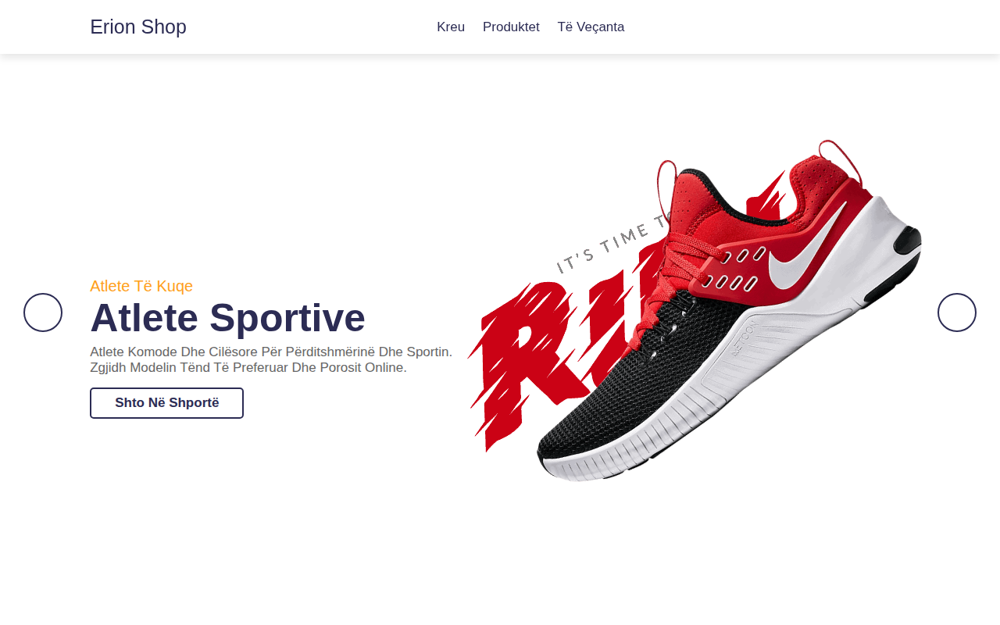

# E-Commerce-Website — Dyqan Online

Created by **Erion Nezha**

Faqe demo e-commerce plotësisht e përgjegjshme (responsive), e përshtatur në gjuhën shqipe. Shfaq produkte, produkte të veçanta, shërbime (dërgesë, kthim, mbështetje), buletin mujor dhe footer me të dhënat e kontaktit.

**Demo live:** https://erionnezha.github.io/E-Commerce-Website/

## Si ta hapni lokalisht

1. Shkarkoni ose klononi këtë repo.
2. Hapni `index.html` në browser — nuk nevojitet server apo build.

## Teknologjitë

- HTML5
- CSS3 (dizajn responsiv)
- JavaScript (slider, menu mobile, galeri produktesh)
- Font Awesome (ikona)

## Shënime

- Çmimet dhe produktet janë demo — vetëm për qëllime ilustrimi.
- Imazhet e produkteve janë pjesë e template-it origjinal.

## Licenca

Të gjitha të drejtat e rezervuara © 2026 Erion Nezha — shih [LICENSE](LICENSE).

Copyright (c) 2026 Erion Nezha

---

# E-Commerce-Website

Created by **Erion Nezha**

A fully responsive e-commerce demo page, localized in Albanian. It showcases products, featured products, services (delivery, returns, support), a monthly newsletter section and a footer with contact details.

**Live demo:** https://erionnezha.github.io/E-Commerce-Website/

## Run locally

1. Download or clone this repo.
2. Open `index.html` in a browser — no server or build step needed.

## Technologies

- HTML5
- CSS3 (responsive design)
- JavaScript (slider, mobile menu, product gallery)
- Font Awesome (icons)

## Notes

- Prices and products are demo content, for illustration only.
- Product images are part of the original template.

## License

All rights reserved © 2026 Erion Nezha — see [LICENSE](LICENSE).

Copyright (c) 2026 Erion Nezha
